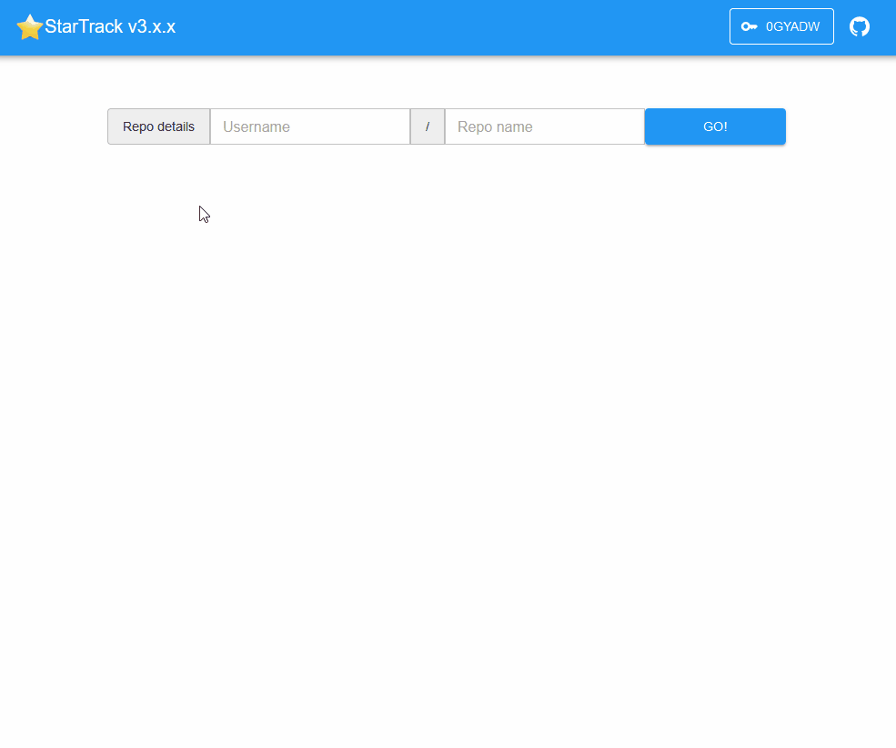

GitHub Star History and Stats - based on JavaScript only, no server side!

Try it now: https://seladb.github.io/StarTrack-js/

## Main features

- View a GitHub repo star history
- Show stargazer stats such as average number of stars per day, max stars in one day, etc.
- Supports showing multiple repos at the same time (very useful for comparison)
- Display a stargazer forecast based on the existing data
- Provide GitHub authentication (via access token) to overcome GitHub API rate limiter which limits the number of API calls without authentication. The authentication details are stored locally and not sent to any server
  - By default they're stored in the browser's session storage
  - The user can choose to store them in the browser's local storage for longer persistence
- Preloading repos by URL, for example: <https://seladb.github.io/StarTrack-js/#/preload?r=seladb,pickledb-rs> will preload `seladb/pickledb-rs` upon loading the page

## What's new in version 2.4?

- Added an option to display a forecast based on the existing stargazer data. The forecast is calculated using [Linear Least Squares](https://en.wikipedia.org/wiki/Linear_least_squares) regression
- Change between username and repo name text boxes using the `/` key (thanks @zaldih !)

## What's new in version 2.3?

- Parallel load of stargazer data which significantly improves the overall loading time (thanks @gsaraf !)
- Display chart data in log scale (thanks @passcod !)

## What's new in version 2.2?

- Added support for smaller screen sizes (mobile devices)
- Small improvements in overall layout

## What's new in version 2.1?

- Added a checkbox to sync the stats with the current chart view displayed. This is useful for viewing stats on specific dates
- You can now paste a GitHub link instead of typing the username and repo name, and they will be parsed automatically
- Added a link to the GitHub repo in the badge displaying the repo details
- Preloading screen: fix decreasing transition in progress bar when loading the next repo
- All React components were replaced from class to function components and are using React Hooks

## What's new in version 2.0?

- A complete rewrite using React and modern frontend technologies
- Significant UI improvements (basically everything looks much better now :-) )
- The chart component has been replaced and it's now easier to navigate, zoom in/out, etc.
- Added an option to remove repos (in version 1.0 you could only add but not remove)
- Added an option to stop loading data
- Each repo has a dedicated color throughout the page (chart series, stats, close button)
- Dedicated preloading screen
  - Shows a progress bar for each repo separately
  - Shows errors for repos which were not loaded successfully
- GitHub authentication improvements
  - When logged in, a new tooltip shows where the access token is stored (browser's session storage or local storage)
  - User + password authentication was removed as it's [no longer supported by GitHub](https://developer.github.com/changes/2019-11-05-deprecated-passwords-and-authorizations-api/#authenticating-using-passwords)

## Technical details

This project is built on [React](https://reactjs.org/) and deployed on [GitHub Pages](https://pages.github.com/). It doesn't have a backend so all of the data is stored locally on the browser and nothing is passed to any server (other than GitHub API to fetch the stargazer data).

It uses the following npm packages:

- [React Bootstrap](https://react-bootstrap.github.io/) for the UI elements
- [ApexCharts](https://apexcharts.com/docs/react-charts/) for displaying charts
- [Axios](https://github.com/axios/axios) for fetching data from GitHub API
- [React Router](https://reacttraining.com/react-router/) for having a separate view for preloading stargazer data
- [Font Awesome](https://fontawesome.com/how-to-use/on-the-web/using-with/react) for cool icons
- [react-github-btn](https://github.com/ntkme/react-github-btn) for displaying GitHub buttons
- [React Google Analytics Module](https://github.com/react-ga/react-ga)
- [parse-github-url](https://github.com/jonschlinkert/parse-github-url) to find GitHub URLs that are being pasted to the repo details text boxes
- [react-responsive](https://github.com/contra/react-responsive) for adjusting the UI according to the screen size (desktop vs. mobile)
- [least-squares](https://github.com/jprichardson/least-squares) for calculating the forecast

Dev packages:

- [ESLint](https://eslint.org/), [Prettier](https://prettier.io/) and their plugins for code linting and formatting
- [husky](https://github.com/typicode/husky), [lint-staged](https://github.com/okonet/lint-staged) and [pretty-quick](https://github.com/azz/pretty-quick) for pre-commit hooks
- [gh-pages](https://github.com/tschaub/gh-pages) for GitHub Pages deployment

GitHub pages deployment status: 

To run it locally follow these steps:

- Clone this repo: `git clone https://github.com/seladb/StarTrack-js.git`
- Enter the repo directory: `cd StarTrack-js`
- Install the node modules required for this app: `npm install`
- Run it locally: `npm start`
