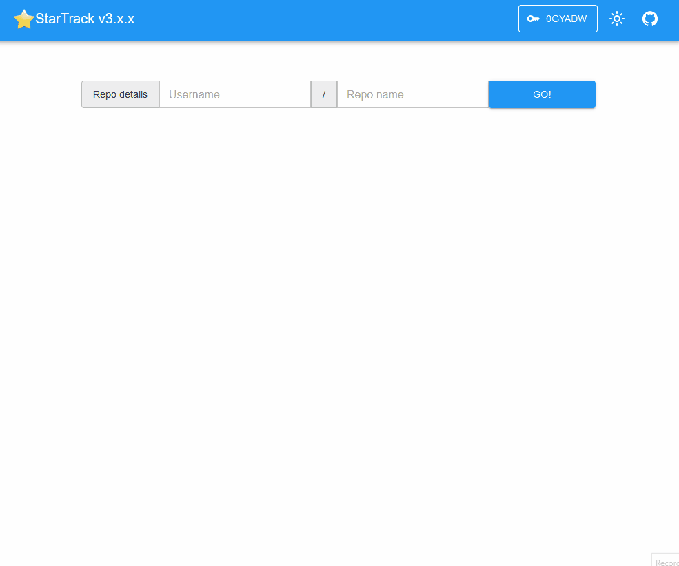

GitHub Star History and Stats - based on JavaScript only, no server side!

Try it now: https://seladb.github.io/StarTrack-js/

## Main features

- View a GitHub repo star history
- Show stargazer stats such as average number of stars per day, max stars in one day, etc.
- Supports showing multiple repos at the same time (very useful for comparison)
- Display a stargazer forecast based on the existing data
- Provide GitHub authentication (via access token) to overcome GitHub API rate limiter which limits the number of API calls without authentication. The authentication details are stored locally and not sent to any server
  - By default they're stored in the browser's session storage
  - The user can choose to store them in the browser's local storage for longer persistence
- Preloading repos by URL, for example: <https://seladb.github.io/StarTrack-js/#/preload?r=seladb,pickledb-rs> will preload `seladb/pickledb-rs` upon loading the page
- Download stargazer data to JSON or CSV file

## What's new in version 3.1.0?

- Enable the option to download stargazer data in JSON or CSV format
- Introduce a warning notification for repositories with an excessive number of stars, indicating limitations imposed by the GitHub API when loading them all
- Introduce dark mode
- Implement better error handling for forecast calculations when recent data is unavailable
- Resolve an issue related to pasting repository GitHub URLs in mobile browsers

## What's new in version 3.0.0?

- A complete rewrite of the codebase using Typescript and modern React
- Migrated from React Bootstrap to Material UI for a more consistent and polished look
- Upgraded the chart component to [Plotly.js](https://plotly.com/javascript/) for better rendering of large datasets and an improved user experience
- Enhanced the GitHub authentication process to provide a smoother and more user-friendly experience
- Improved the forecast selection process to make it easier for users to choose a desired forecast
- When syncing between the repo stats and the chart, displays the date range of the chart
- Complete test coverage of all components

## What's new in version 2.4.0?

- Added an option to display a forecast based on the existing stargazer data. The forecast is calculated using [Linear Least Squares](https://en.wikipedia.org/wiki/Linear_least_squares) regression
- Change between username and repo name text boxes using the `/` key (thanks @zaldih !)

## What's new in version 2.3.0?

- Parallel load of stargazer data which significantly improves the overall loading time (thanks @gsaraf !)
- Display chart data in log scale (thanks @passcod !)

## What's new in version 2.2.0?

- Added support for smaller screen sizes (mobile devices)
- Small improvements in overall layout

## What's new in version 2.1.0?

- Added a checkbox to sync the stats with the current chart view displayed. This is useful for viewing stats on specific dates
- You can now paste a GitHub link instead of typing the username and repo name, and they will be parsed automatically
- Added a link to the GitHub repo in the badge displaying the repo details
- Preloading screen: fix decreasing transition in progress bar when loading the next repo
- All React components were replaced from class to function components and are using React Hooks

## What's new in version 2.0.0?

- A complete rewrite using React and modern frontend technologies
- Significant UI improvements (basically everything looks much better now :-) )
- The chart component has been replaced and it's now easier to navigate, zoom in/out, etc.
- Added an option to remove repos (in version 1.0 you could only add but not remove)
- Added an option to stop loading data
- Each repo has a dedicated color throughout the page (chart series, stats, close button)
- Dedicated preloading screen
  - Shows a progress bar for each repo separately
  - Shows errors for repos which were not loaded successfully
- GitHub authentication improvements
  - When logged in, a new tooltip shows where the access token is stored (browser's session storage or local storage)
  - User + password authentication was removed as it's [no longer supported by GitHub](https://developer.github.com/changes/2019-11-05-deprecated-passwords-and-authorizations-api/#authenticating-using-passwords)

## Technical details

This project is built on [React](https://reactjs.org/) and deployed on [GitHub Pages](https://pages.github.com/). It doesn't have a backend so all of the data is stored locally on the browser and nothing is passed to any server (other than GitHub API to fetch the stargazer data).

It uses the following `yarn` packages:

- [Material UI](https://mui.com/material-ui/) for the UI components
- [Plotly.js](https://plotly.com/javascript/) for displaying charts
- [Axios](https://github.com/axios/axios) for fetching data from GitHub API
- [React Router](https://reactrouter.com/) for handling client side routing
- [React Testing Library](https://testing-library.com/docs/react-testing-library/intro/) as the testing framework
- [Formik](https://formik.org/) for building forms
- [React Google Analytics Module](https://github.com/react-ga/react-ga)
- [Moment.js](https://momentjs.com/) for manipulating date time
- [react-responsive](https://github.com/contra/react-responsive) for adjusting the UI according to the screen size (desktop vs. mobile)
- [react-github-btn](https://github.com/ntkme/react-github-btn) for displaying GitHub buttons
- [client-zip](https://github.com/Touffy/client-zip) for downloading data that includes multiple files

Dev packages:

- [ESLint](https://eslint.org/), [Prettier](https://prettier.io/) and their plugins for code linting and formatting
- [CSpell](https://cspell.org/) for spell check
- [Playwright](https://playwright.dev/) for integration tests

To run it locally follow these steps:

- Clone this repo: `git clone https://github.com/seladb/StarTrack-js.git`
- Enter the repo directory: `cd StarTrack-js`
- Install the node modules required for this app: `yarn install`
- Run it locally: `yarn run start`
